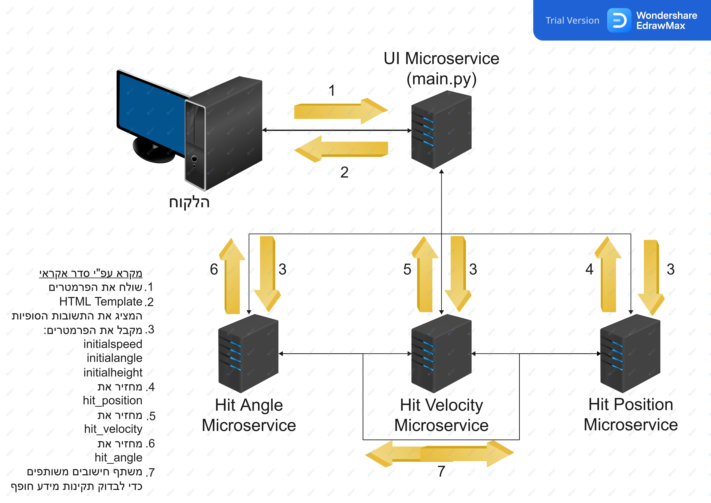

# מחשבון פיזיקה - משימת הזבובון #

לפני שנתחיל, בכדי להריץ את הפרויקט באופן תקין נצטרך להתקין את הספרייה flask.
אנו נעשה זאת בעזרת השלבים הבאים:

1. נפתח את הcmd.
2. ננווט לתיקיה בה הפרוייקט מאוחסן בעזרת הפקודה ```cd PATH```.
3. משם נשתמש בפקודה ```\cd .\backend``` וניכנס לתיקייה backend.
4. נשתמש בפקודה הבאה: ```pip install -r requirements.txt``` ונחכה מספר רגעים.
5. בכדי להריץ את הפרויקט נריץ את הקובץ main.py בעזרת הפקודה ```py .\main.py```.
6. בשביל לגשת לאפליקציה ניכנס לדפדפן לבחירתנו ונכניס את הurl הבא: http://localhost:3200/
7. זהו, הפרויקט עובד :)

## שלב 1 - לוגיקה עסקית ##

### שאלה 4 ###

אנו נוכל לוודא כי המוצר שבנינו מוסר ללקוח תשובות נכונות בעזרת בדיקת התוצאות והשוואתן אל תוצאות של מוצרים דומים באינטרנט. בנוסף, נוכל לעשות ניסויים רבים עם קלטים רבים ולראות האם התשובה שיוצאת לנו היא אותה התשובה שיוצאת בעת חישוב ידני.

יתר על כן, מקרי הקיצון שיכולים להיות הם הטלת הזבובון בגובה 0. כלומר, הקלט יהיה גם הפלט משום שזו תהיה נקודת הפגיעה בקרקע של הזבובון. מעבר לזה, ישנו מקרה קיצון נוסף בו המהירות ההתחלתית הינה 0. כלומר, הזבובון הוטל וכרגע נמצא בנפילה חופשית.

בנוסף לכל הנ"ל, ישנן בעיות טכניות אשר עלולות לצוץ בעת שימוש במערכת. לדוגמא, שליחת קלט לא תקין הכולל אותיות כגון המחרוזת "invalid_input". קלט זה יקריס את השרת. במערכת שלנו אני תכנתתי פונקציות המבצעות תקינות קלט. כלומר, הלקוח לא יכול להזין אותיות או בעצם קלט שאינו מספר תקין.

בסטנדרט IEEE 754 יש כל מיני מספרים מיוחדים כגון Infinity, NaN, -Infinity, -0, +0 וכו. רוב המספרים הללו יכולים להקריס את השרת, אולם כפי שהוזכר לעיל, במערכת ישנן פונקציות המבצעות תקינות קלט, הקלטים המיוחדים שהלקוח יכול להזין הם רק 0+ ו-0-. קלטים אלו לא מעוותים את תוצאות החישוב.

בנוסף, ישנם מספרים הנמצאים מחוץ לטווח המספרים שהסטנדרט IEEE 754 מאפשר. הסטנדרט מסוגל לאחסן מספרים עם עד 8 ביטי מערך, בעצם עד 256 מספרים בינאריים עשרוניים. בפועל, יוצא שרמת דיוק החישובים הפנימיים, ורמת דיוק התשובות הסופיות הן רק עד 8 ספרות אחרי הנקודה העשרונית. כלומר, דיוק הקלטים וחישוביהם מוגבלים מאוד וברוב המקרים תצא סטייה מסויימת בשל אי דיוק זה.

ניתן לפתור בעיה זו בעזרת שימוש במודול Decimal בפייתון. מודול זה מאפשר לנו לחשב מספרים עם רמת דיוק גבוהה יותר שכן מאפשר לחשב מספרים עשרוניים ברמת דיוק שהשרת מגדיר. בכך, נוכל למזער את הסטייה ורמות אי הדיוק. ישנו חיסרון בשימוש במודול זה שכן ככל שרמת הדיוק יותר גדולה כך מהירות ויעילות החישובים תקטן.

### שאלה 5 ###

המודל הפיזיקלי אינו מתאר בצורה מדויקת לחלוטין התנהגות מציאותית, נוכל לשפר את המודל בכך שנתחשב בחיכוך האוויר.

בנוסף לכך, אנו לא מתייחסים לטופוגרפיה. כרגע, אנו מחשבים מיקום עפ"י גובה התחלתי ומהירות התחלתית בהנחה שהעולם שטוח (פלטה אחת גדולה). זה לא המקרה במציאות וישנן סיטואציות שמטוס יטיל זבובון לכיוון הר או לכיוון בקעה.

במקרה שהזבובון הוטל לכיוון הר, אז הזבובון יפול במיקום יותר קרוב לנקודת השלכת הזבובון ולא במיקום שהחישוב יראה משום שהוא אינו יודע שבדרך ההר עצר את הזבובון.

במקרה שהזבובון הוטל לכיוון בקעה, אם המטוס מטיל את הזבובון בגובה 5000 מטרים מהנקודה הנוכחית לעבר בקעה אשר תחתיתה נמצאת 500 מטרים מתחת לפני הקרקע של מיקום ההטלה (מרחק אנכי בלבד), הרי שהמרחק האנכי שהזבובון יעבור הינו 5500 מטרים, ולא 5000 מטרים.

כלומר אומנם המטוס כרגע נמצא 5000 מטרים מעל הקרקע, אך בגלל שתחתית הבקעה נמצאת 500 מטרים מתחת לפני נקודת ההטלה, הזבובון יעבור מרחק אנכי של 5500 מטרים, לכן הגובה ההתחלתי אמור להיות 5500 ולא 5000, למרות שמד הגובה של המטוס יראה 5000 מטרים מעל פני הקרקע וכרגע המערכת תשתמש בנתון זה לבצע את החישובים. כמובן שדבר זה משפיע על החישובים משום שהמהירות בעת הפגיעה, זווית הפגיעה ומיקום הזבובות יושפעו משום שהזבובון עף יותר מרחק וזמן.

בעצם, נוכל לשפר את המודל בעזרת לקיחת מידע ממכ"מ המטוס, אשר יודע מה נמצא מול המטוס, כולל הטופוגרפיה. נוכל עפ"י מידע זה לחשב מה נקודת הפגיעה המשוערת עפ"י הנתונים ההתחלתיים ושילוב של נתוני מכ"מ המטוס.

בנוסף לטופוגרפיה ולחיכוך האוויר, כדור הארץ הוא בעל צורה עגולה. כלומר בגבהים מאוד גבוהים קימור כדור הארץ ישפיע על המרחק שהזבובון יעבור עד הפגיעה.
אם כן, עלינו למצוא דרך מתמטית לחשב את פני שטח כדור הארץ ולתרגמו לכדי יכולת לחשב את מיקום פגיעת הזבובון בהתחשב קימור כדור הארץ.

## שלב 2 - ארכיטקטורה ##

### שאלה 4 ###

אנו נבחר לממש את הארכיטקטורה בצורה הבאה:

יש לנו לקוח שמתחבר אל שרת מרכזי (במקרה שלנו זה main.py).

הלקוח מקבל בחזרה עמוד HTML בו מתממש ה-UI. כלומר, הלקוח מתנהל מול ה-UI Microservice בלבד. בסרביס זה הלקוח יכול להזין פרמטרים ולשלוח לסרביס בקשת חישוב. לאחר שליחת הנתונים אל ה-UI Microservice הלקוח יקבל את התוצאות וה-UI יציג אותן במקום המתאים.

ה-UI Microservice ישלח את הפרמטרים אשר הלקוח הזין אל כל אחד מה-Microservices האחרים ויצפה לקבל מכל אחד מהם את החישוב עליו הוא אמון. בנוסף, כל Microservice ישתף את החישובים שהוא עשה עם הסרביסים האחרים על מנת לוודא תקינות מידע. כל זה מתואר בשרטוט הבא:



עפ"י השרטוט הנ"ל ניתן לראות את זרימת המידע במערכת ואת מבנה הארכיטקטורה. זו מערכת מבוזרת. כלומר, מבוססת Microservices.

המערכת הקיימת ב-repo זה אינה מערכת מבוזרת אלא מערכת בעלת ארכיטקטורה ריכוזית הנקראת Monolithic Architecture.

מערכת מונוליטית היא מערכת בה יש בסיס קוד אחד לכל הלוגיקה העסקית. בדיוק כמו שיש בקוד שלנו, שהלוגיקה העסקית שנמצאת בקובץ physics_calculator.py רצה על אותה מערכת כמו השרת המרכזי שאחראי על ה-UI שהוא הקובץ main.py.

השרת שנמצא בקובץ main.py מייבא את הפעולות הנדרשות לחישוב מהקובץ physics_calculator.py ואינו שולח בקשת HTTP לשרת אחר, או בעצם ל-Microservice כדי שהוא יבצע את החישובים עבורו ובעצם יפצל את עומס העבודה.

כלומר, למרות שלא מימשנו מערכת מבוזרת כרגע, אם היינו מממשים אותה זה היה עפ"י התרשים הנ"ל.

### שאלה 6 ###

כאשר נשלחת בקשת חישוב לא צפויה אנו נרצה להחזיר ללקוח קוד שגיאה 422 (422 Unprocessable Entity response status code).
קוד תגובה זה הוא הכי מתאים משום שמדובר על כך שאחד או יותר מהפרמטרים אינו מאפשר לשרת לחשב את החישוב הרצוי. לדוגמא, אם הועבר פרמטר שמכיל אותיות, השרת יחזיר קוד שגיאה 422 חזרה ללקוח.

במערכת שאנחנו מימשנו אנו דאגנו לכל בעיות תקינות הפרמטרים בצד הלקוח. יש לנו מערכת שמזהה את הקלט שהלקוח מכניס ומחליטה אם הקלט תקין עבור החישוב הנדרש עפ"י Regular Expressions שאנחנו הצבנו. בנוסף, יש במערכת פונקציות TypeScript שתפקידן לוודא תקינות קלט. לדוגמא, על מנת שנוכל לחשב בצורה מהימנה את החישוב הנדרש אנו צריכים שנתון הזווית ההתחלתית יהיה בתחום ההגדרה x <= 90 ו- x => -90. הייתי כותב את תחום ההגדרה כתחום אך הקובץ לא מאפשר לי בגלל שהשפה בעברית וכיוון הכתיבה הוא מימין לשמאל.

### שאלה 7 ###

בהתחשב בסיווג המערכת, כדי להגן על הנתונים שזורמים במהלך התקשורת אנו נשתמש בהצפנה ונשלח מידע מוצפן על גבי הרשת במהלך התקשורת.

### שאלה 8 ###

במידה ו-2 או יותר משתמשים מבקשים את אותו החישוב אנו נוכל לייעל את המערכת בעזרת שימוש בבסיס נתונים אשר יישמור כל קלט שיישלח אל המערכת וכל חישוב שהמערכת תבצע עפ"י קלט זה. כך, לפני כל ביצוע חישוב, המערכת תחפש בבסיס הנתונים אם הקלט שהתקבל כבר קיים במערכת, אם כן אז המערכת תחזיר את התוצאה הכתובה בבסיס הנתונים, ואם לא, המערכת תבצע חישוב, תשלח אותו ללקוח ותאחסן את החישוב עם הקלט המתאים בבסיס הנתונים.

### שאלה 9 ###

כאשר השימוש במערכת יהיה אינטנסיבי והמון לקוחות יישתמשו בה באותו זמן אנחנו יכולים לממש את השרת כך שישלב בתוכו Multi-Threading ובעצם יאפשר לחשב את כל החישובים של כל הלקוחות בו זמנית ולא יגרום לכל לקוח לחכות עד שהבקשה של הלקוח הקודם תושלם. כלומר, ליצור Multi-Threaded HTTP Server.

במערכת שממשנו אנחנו משתמשים בספרייה Flask אשר בה Multi-Threading מאוד קל לביצוע והספרייה דואגת לבצע את הפעולות במקביל בצורה מאוד פשוטה. כל מה שאנחנו צריכים לעשות זה להעביר כפרמטר את הערך ```threaded=True``` בשורה מס' 38 בקובץ main.py.

## שלב 3 - אפליקציה ##

### שאלה 4 ###

בעת פיתוח ממשק המשתמש אנו נשים דגש על בדיקת תקינות הקלטים בצד הלקוח ועל מבנה HTML תקין. נשתמש באלמנטים בצורה מסודרת ונבצע עיצוב נאה כך שכל ממשק המשתמש פשוט לשימוש וקל להבנה לכל אדם אשר עלול להשתמש בו.

### שאלה 5 ###

כאשר מפתחים אפליקציות web ישנה עדיפות להשתמש באחד מה-frameworks הפופולריים של JavaScript כגון React, Angular ו-Vue.
משום שתרגיל זה דרש Single Page Application לא היה צורך הכרחי לבנות את הפרויקט הזה באחד ה-frameworks.

למרות היכולת להשתמש בטכנולוגיה בסיסית בתחום העיצוב כמו CSS בחרנו להשתמש ב-SCSS שהיא טכנולוגיה המאספת עיצובי CSS בשבילנו ומוסיפה פיצ'רים רבים כמו היכולת להקצות משתנים, nesting ועוד. בעצם, SCSS מקל על כתיבת קוד CSS.

בנוסף לאלו, החלטתי להשתמש ב-TypeScript ולא ב-JavaScript רגיל בשביל להקל על הליך הפיתוח.

אנו השתמשנו ב-TypeScript משום שהוא מוסיף פונקציונליות רבה לעומת JavaScript רגיל כגון היכולת לנהל משתנים בדומה לדרך שבה השפה Java מנהלת משתנים (מבחינת ה-type של המשתנה, האם הוא בוליאני, מחרוזת, מספר וכו'). בעצם TypeScript מבצע בשבילנו בדיקות לגבי סוגי המשתנים, דבר ש-JavaScript לא עושה ומוביל להרבה באגים ובעיות בקוד.
